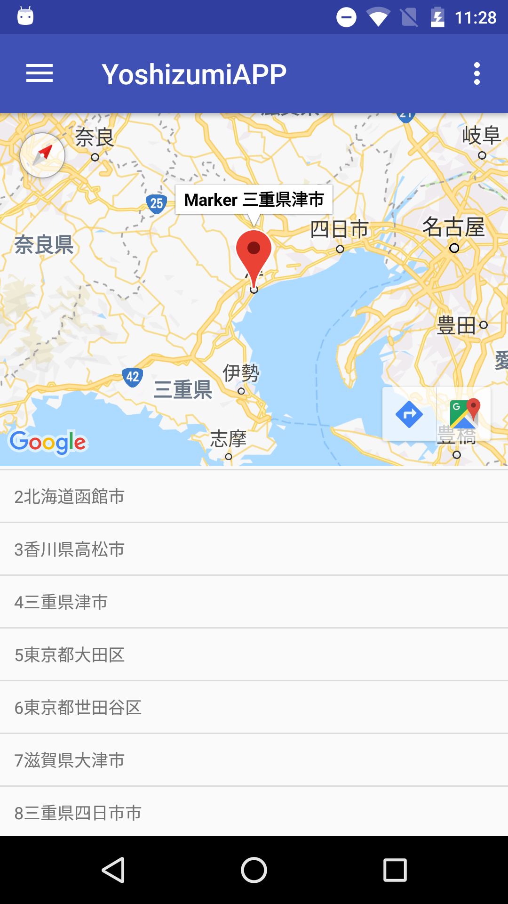

# Apps repository
https://github.com/suzuryu/YoshizumiAPP

# Team Member
| <a href="https://github.com/suzuryu" target="_blank">**Ryusei Suzuki**</a> | <a href="https://github.com/YudaiOjima" target="_blank">**Yudai Ojima**</a> | <a href="https://github.com/akimoto-kengo" target="_blank">**Kengo Akimoto**</a> | <a href="https://github.com/Salesio-CS/2018-05-oratorio" target="_blank">**Kouhei Kadokura**</a> |

# Screen Shot

      

# Features
You can search cities where are confortable to live.
(takes 10~20sec for first start)

# Development Environment
* Android studio
* Android API version 26

The app is written entirely in Java and uses the Gradle build system.

To build the app, use the `gradlew build` command or use "Import Project" in
Android Studio. A canary or stable version >= 3.2 of Android Studio is
required and may be downloaded
[here](https://developer.android.com/studio/archive).
