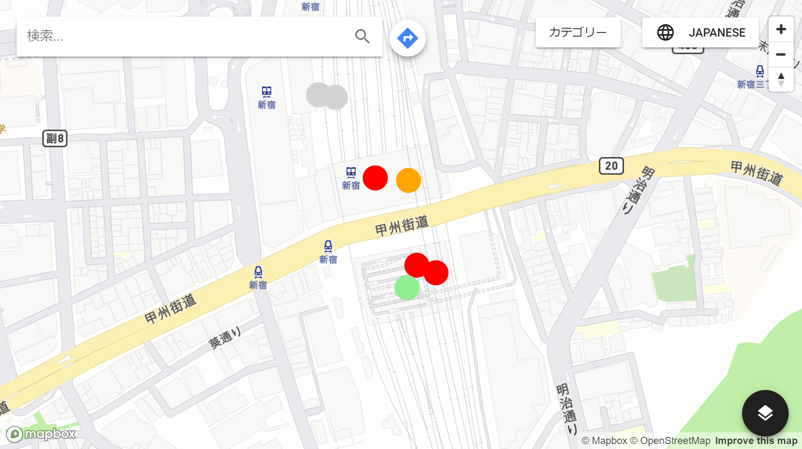

> 2018-10 Project-X

# Tourismap

## ScreenShot

## Team Member
|||
|:---:|:---:|
|リーダー |  [syuchan1005](https://github.com/syuchan1005)||
|バックエンド| [mu-chan1910](https://github.com/mu-chan1910)|
|フロントエンド| [re-ma2000](https://github.com/re-ma2000)|

### Dropout
| [ShogoYoshida](https://github.com/ShogoYoshida) |  [matsumoto13553](https://github.com/matsumoto13553)|
|:--:|:--:|

## How to use it
> Attention: We'll need to start backend first.

### backend
1. move to `backend` folder
1. `.envtemplate` rename to `.env` and fill properties
1. `npm install`
1. `npm run build`
1. `npm start`

### frontend
1. move to `frontend` folder
1. `npm install`
1. `npm run build`
1. `npm start`
